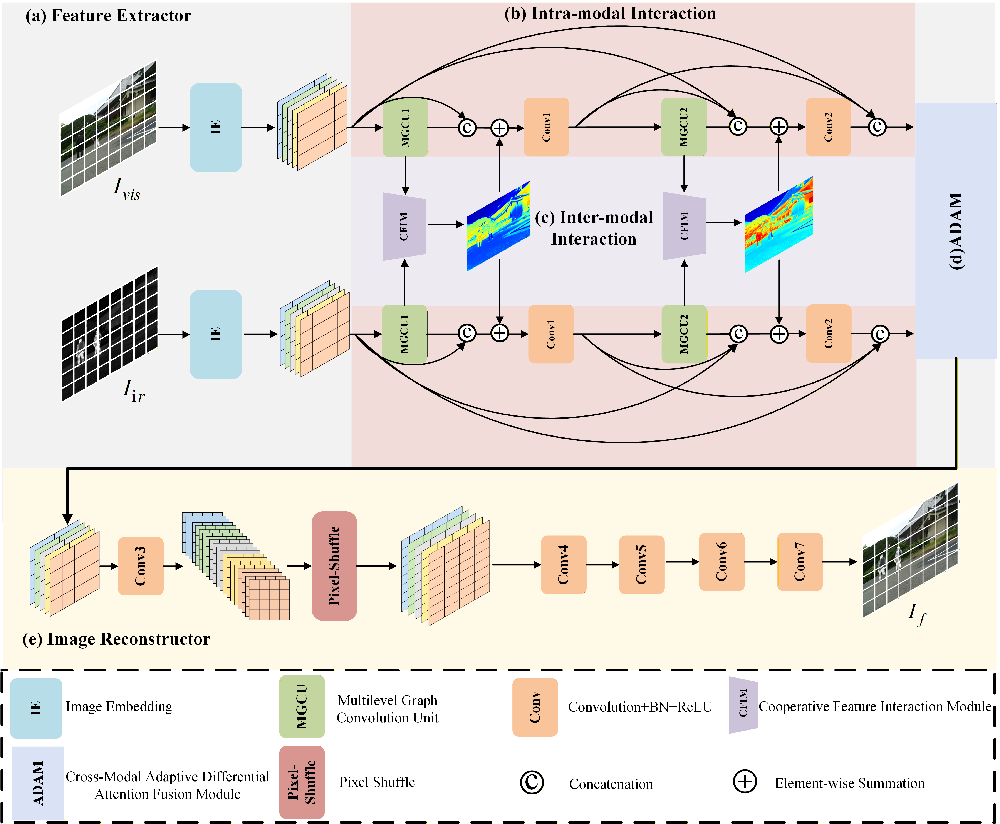
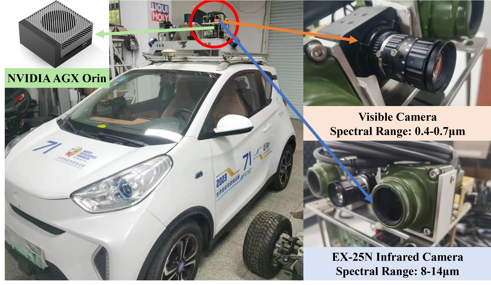
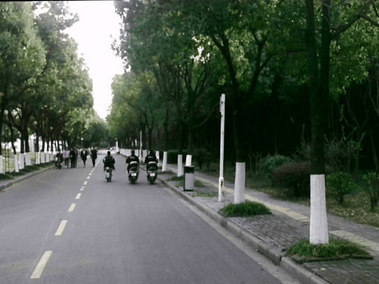
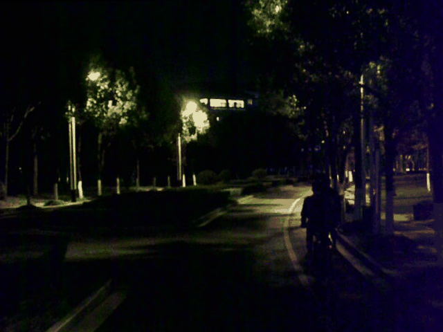
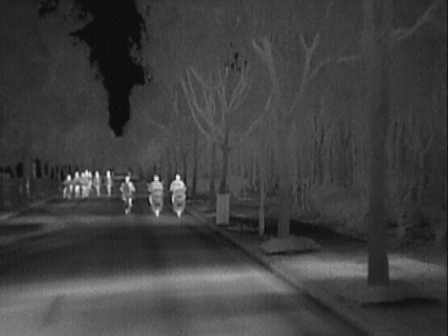
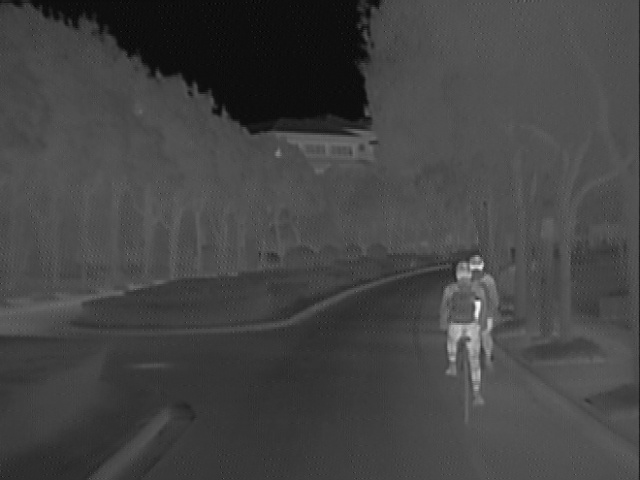
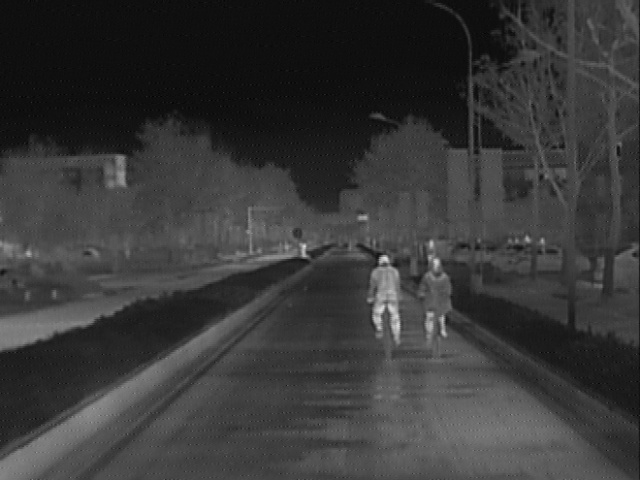
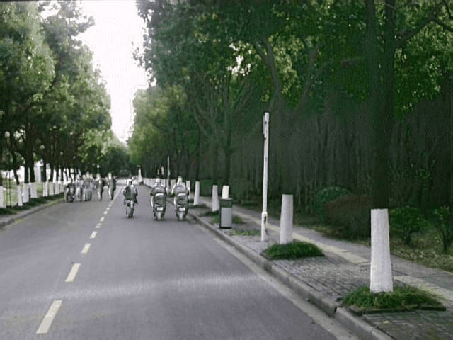
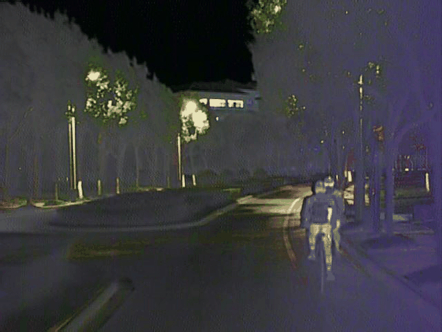
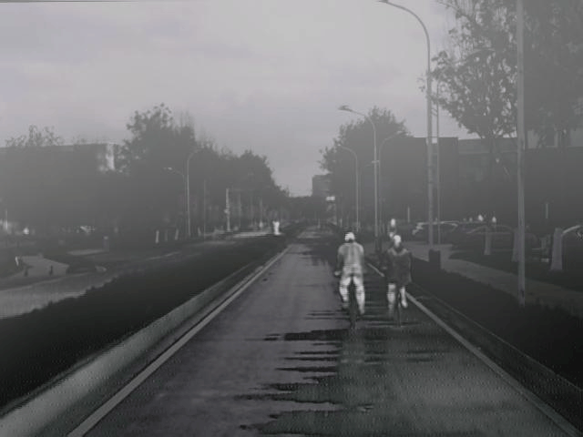

<div align="center">

# HGI²Fusion: Hierarchical Graph Infromation Interaction Network for Infrared- and Visible Image Fusion

<!-- [](链接待补充)
[](链接待补充)
[](LICENSE) -->

</div>

---

## 📖 Introduction


Infrared and visible image fusion merges the distinct details from each source to create a unified image that captures the full scene.
However, existing CNN-based methods suffer from limited receptive fields and often fail to capture long-range contextual depen-
dencies, while Transformer-based approaches may introduce redundant correlations among image patches. Moreover, commonly
used fusion strategies, such as direct concatenation or simple weighting, struggle to adapt to the complex variations encountered in
real-world environments. To address these challenges, we propose HGI²Fusion, a hierarchical graph information interaction frame-
work that leverages the flexibility of graph representations to extract and propagate fine-grained modality-specific features without
redundancy. The Multilevel Graph Convolutional Unit (MGCU) captures long-range relationships through hierarchical graph mod-
eling, and the Cooperative Feature Interaction Module (CFIM) promotes effective inter-modal interplay to enhance complementary
information. In addition, the Adaptive Differential Attention Module (ADAM) adaptively allocates fusion weights based on cross-
modal contextual cues, enabling robust feature integration across diverse conditions. Extensive experiments on public datasets,
downstream high-level vision tasks, and real-vehicle scenarios demonstrate the superior fusion quality, generalization capability,
and deployability of HGI²Fusion compared with state-of-the-art methods.

<!-- 论文摘要 -->
<!-- TODO: 在此处添加论文摘要 -->

---

## 🏗️ Network Architecture

<div align="center">

</div>

<p align="center">
<em>Overall framework of the proposed HGI²Fusion.</em>
</p>

---

## 🚗 Real-World Vehicle Experiments

We conducted extensive real-world experiments under various challenging scenarios to evaluate the robustness and effectiveness of our method.

<div align="center">

</div>

<p align="center">
<em>Autonomous vehicle platform equipped with infrared and visible sensors for real-world fusion experiments.</em>
</p>

<table align="center">
  <tr>
    <th></th>
    <th>☀️ Day</th>
    <th>🌙 Night</th>
    <th>🌫️ Fog</th>
    <th>💡 High Exposure</th>
  </tr>
  <tr>
    <td><b>Visible</b></td>
    <td></td>
    <td></td>
    <td></td>
    <td></td>
  </tr>
  <tr>
    <td><b>Infrared</b></td>
    <td></td>
    <td></td>
    <td></td>
    <td></td>
  </tr>
  <tr>
    <td><b>Fusion</b></td>
    <td></td>
    <td></td>
    <td></td>
    <td></td>
  </tr>
</table>

<p align="center">
<em>Qualitative results of our HGI²Fusion on real-world driving scenarios.</em>
</p>

---

<!-- ## 🛠️ Installation

```bash
# Clone the repository
git clone https://github.com/your-username/HGI2Fusion.git
cd HGI2Fusion

# Create conda environment
conda create -n hgi2fusion python=3.8 -y
conda activate hgi2fusion

# Install dependencies
pip install -r requirements.txt
```

---

## 🚀 Quick Start

### Testing

```bash
python test.py --config configs/test.yaml --checkpoint checkpoints/best_model.pth
```

### Training

```bash
python train.py --config configs/train.yaml
```

---

## 📊 Results

<!-- TODO: 在此处添加定量结果表格 -->

<!-- ---

## 📝 Citation

If you find this work useful for your research, please consider citing our paper:

```bibtex
@article{HGI2Fusion2024,
  title={HGI$^2$Fusion: Hierarchical Graph Interaction Network for Infrared-Visible Image Fusion},
  author={作者姓名},
  journal={期刊名称},
  year={2024}
}
```

<!-- --- -->

## 🙏 Acknowledgement

We sincerely thank the following excellent works and open-source projects:

- [SeAFusion](https://github.com/Linfeng-Tang/SeAFusion)
- [VIF-Benchmark](https://github.com/Linfeng-Tang/VIF-Benchmark)

<!-- This work was supported by [基金资助信息]. -->

---

## 📧 Contact

If you have any questions, please feel free to contact us:

- **Email**: zhichaoliu@seu.edu.cn

---

<div align="center">

**⭐ If you find this repository helpful, please give us a star! ⭐**

</div>

